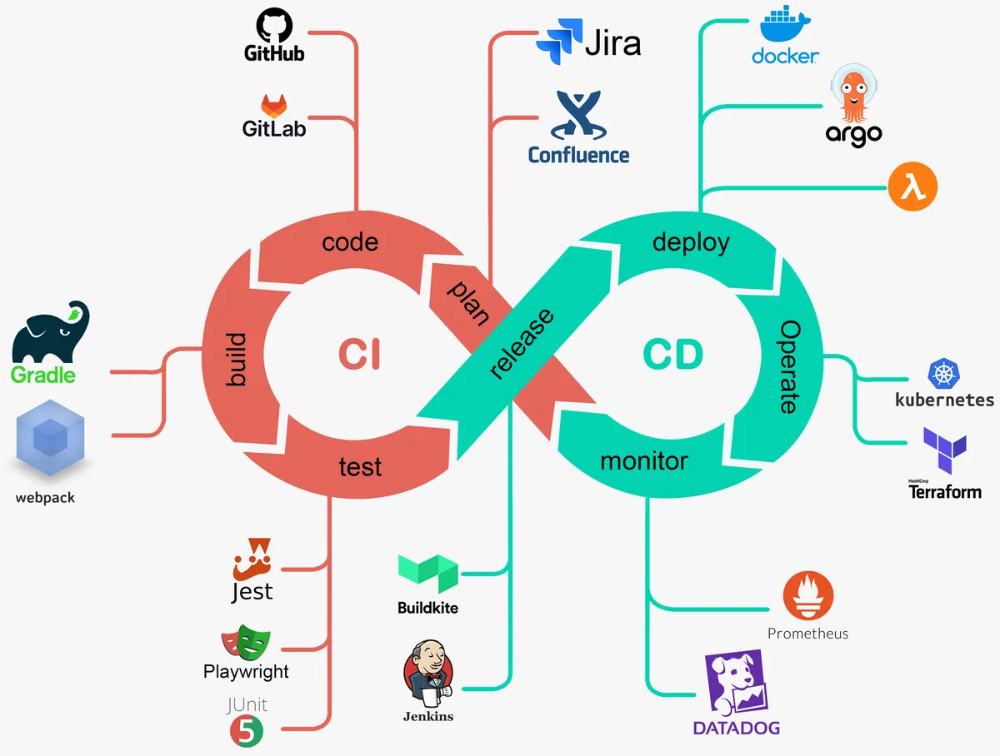
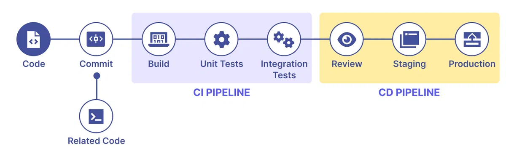

# CI/CD (Continuous Integration/Continuous Deployment)

## Khái niệm
- Là tập hợp phương pháp và công cụ tự động hóa quy trình phát triển, kiểm thử và triển khai phần mềm
- Mục tiêu chính là tăng tốc phát hành, giảm lỗi và cải thiện sự ổn định của các phiên bản phần mềm (release).

  

## Continuous Integration (CI)
- Là quá trình tự động kiểm tra và tích hợp code mới vào code chính của dự án
- Nhằm phát hiện lỗi sớm trước khi ảnh hưởng đến hệ thống. 
- Mỗi thay đổi code và commit sẽ kích hoạt các bài kiểm tra tự động để đảm bảo mã không gây lỗi.

  

### Các bước cơ bản của CI
- **Functional tests**: Kiểm tra phần mềm hoạt động đúng như mong đợi. *Ví dụ*: người dùng có thể thêm sản phẩm vào giỏ hàng và thanh toán thành công.
- **Security scans**: Kiểm tra lỗ hổng bảo mật, như SQL Injection hoặc XSS.
- **Code quality scans**: Đảm bảo code tuân thủ các tiêu chuẩn về độ dài hàm, quy tắc style, và cách đặt tên biến.
- **Performance tests**: Kiểm tra hiệu suất của code. *Ví dụ*: thời gian xử lý yêu cầu hoặc khả năng chịu tải.
- **License scanning**: Kiểm tra giấy phép của các thư viện và công cụ để tránh vấn đề pháp lý.
- **Fuzz testing**: Gửi dữ liệu bất thường vào ứng dụng để kiểm tra khả năng xử lý lỗi hoặc crash.

### Lợi ích
- CI giúp phát hiện lỗi sớm, tiết kiệm thời gian và công sức, vì việc sửa lỗi ngay khi phát hiện dễ dàng hơn khi lỗi đã lan rộng.
  - **Ví dụ**: Khi phát triển tính năng mới, thay vì đợi đến cuối quá trình để kiểm tra, CI cho phép kiểm tra ngay khi viết code, giúp phát hiện và sửa lỗi khi vấn đề còn nhỏ.
- CI cũng giúp toàn bộ đội nhóm theo dõi tiến trình và trạng thái của phần mềm. Các thành viên từ lập trình viên đến QA, UX, và bảo mật đều có thể nhận biết tình trạng dự án và điều chỉnh công việc phù hợp.
  - **Ví dụ**: Khi kiểm tra bảo mật được thực hiện thường xuyên, nếu CI phát hiện lỗ hổng bảo mật, cả nhóm sẽ biết ngay và có thể phân bổ nguồn lực để sửa chữa hoặc điều chỉnh kế hoạch phát triển.

## Continuous Deployment (CD)
CD là quá trình đưa code từ môi trường phát triển lên môi trường người dùng (website, ứng dụng di động). Có **2** loại CD chính:

- **Continuous Delivery (Phân phối liên tục)**: Đảm bảo code luôn sẵn sàng để triển khai bất cứ lúc nào. Sau khi qua kiểm tra CI, code sẽ ở trạng thái sẵn sàng để triển khai, nhưng việc triển khai có thể thực hiện thủ công.
- **Continuous Deployment (Triển khai liên tục)**: Tự động triển khai code ngay khi vượt qua tất cả kiểm tra, không cần sự can thiệp thủ công.

  

### Các bước cơ bản của CD
- **Build**: Quá trình biên dịch code cho các ngôn ngữ như C, C++, Java trước khi triển khai.
- **Deploy**: Triển khai code, chẳng hạn đẩy Docker image lên repository hoặc dùng lệnh để đưa code lên AWS. Việc triển khai có thể tự động hoặc thủ công, tùy vào cách thiết lập.
- **Ví dụ**: Sau khi hoàn thành tính năng giỏ hàng, CD sẽ tự động kiểm tra, đóng gói và triển khai tính năng lên website để khách hàng có thể sử dụng ngay lập tức.

### Lợi ích của CD
- Mục tiêu của CD là giúp việc triển khai và phát hành phần mềm trở nên dễ dàng, thường xuyên và ít rủi ro. Khi CD được thiết lập, mỗi lần commit code, code sẽ tự động triển khai vào các môi trường như review, staging hoặc production.
- Các môi trường ngoài production (như review và staging) đóng vai trò thử nghiệm, đảm bảo code hoạt động ổn định trước khi phát hành chính thức cho người dùng.

## Lợi ích của CI/CD
- **Tăng tốc độ phát triển và triển khai**: Tự động hóa kiểm tra và triển khai giúp nhanh chóng đưa code vào môi trường production mà không gián đoạn hệ thống, giúp doanh nghiệp phát hành tính năng mới và bản vá lỗi nhanh chóng, đáp ứng nhu cầu người dùng kịp thời.
- **Giảm thiểu lỗi và rủi ro**: CI/CD tự động kiểm tra code sau mỗi lần commit, giúp phát hiện và sửa lỗi sớm trước khi triển khai lên production.
- **Tăng cường sự hợp tác**: Mọi người trong nhóm đều có thể theo dõi tiến độ build, cải thiện việc phối hợp và đảm bảo phần mềm đạt chất lượng cao.
- **Đảm bảo tính nhất quán**: CI/CD duy trì tính nhất quán trong phát hành phần mềm, đảm bảo tất cả các bản build đều tuân thủ quy trình kiểm tra chuẩn.
- **Hỗ trợ mở rộng và duy trì hệ thống phức tạp**: CI/CD giúp tự động hóa quy trình, giảm tải công việc và đảm bảo sự ổn định, khả năng mở rộng cho các hệ thống lớn.
- **Tối ưu hóa chi phí và tài nguyên**: CI/CD tiết kiệm thời gian và tài nguyên, giảm chi phí nhân lực và lỗi phát sinh từ thao tác thủ công.